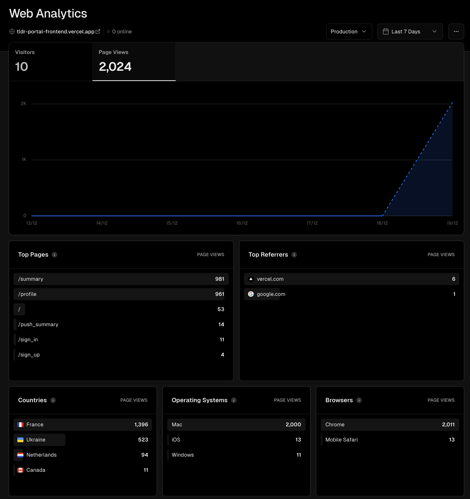
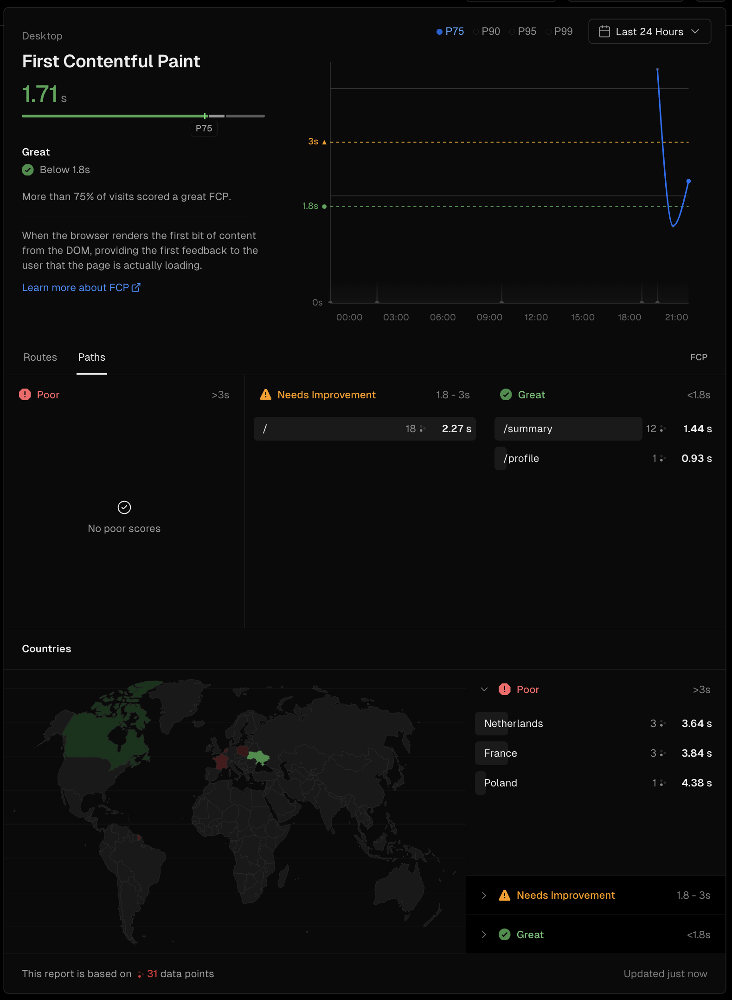
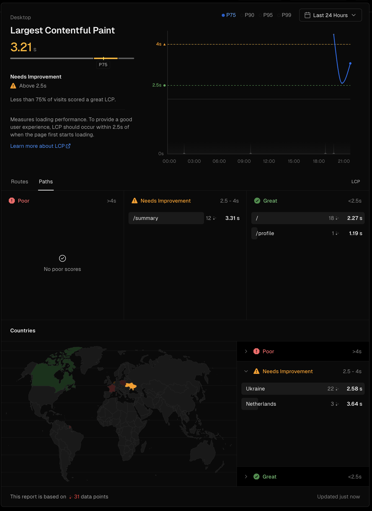
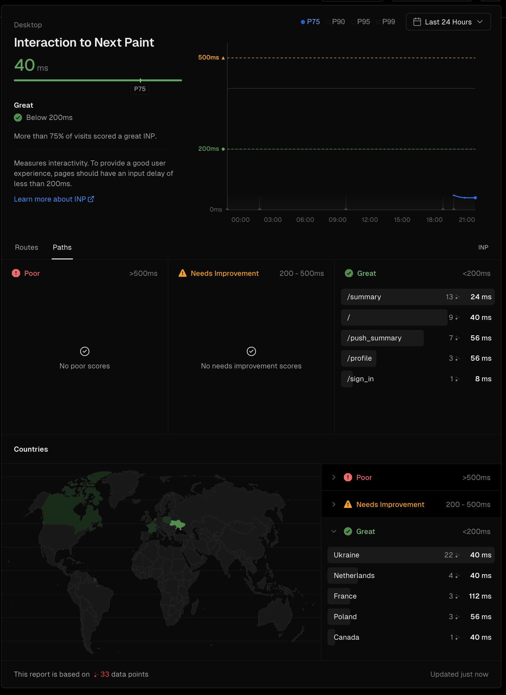
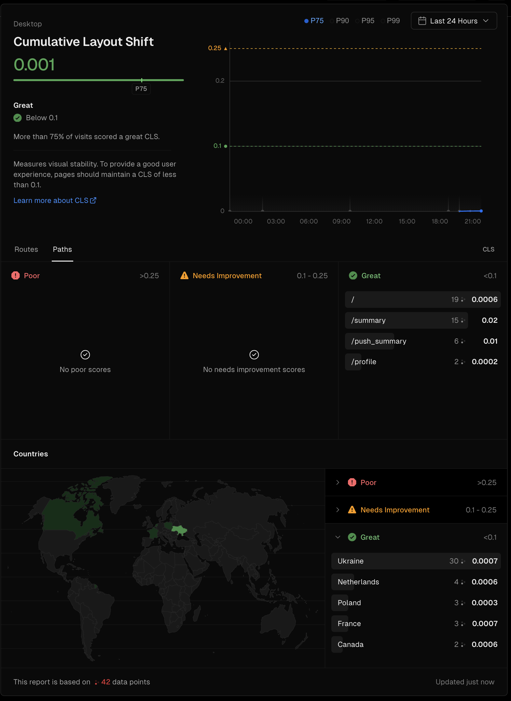
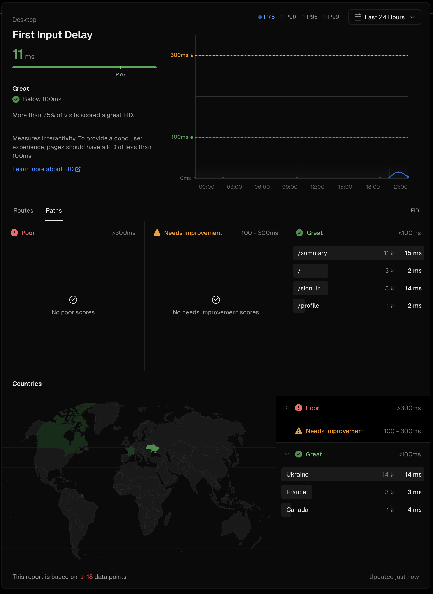
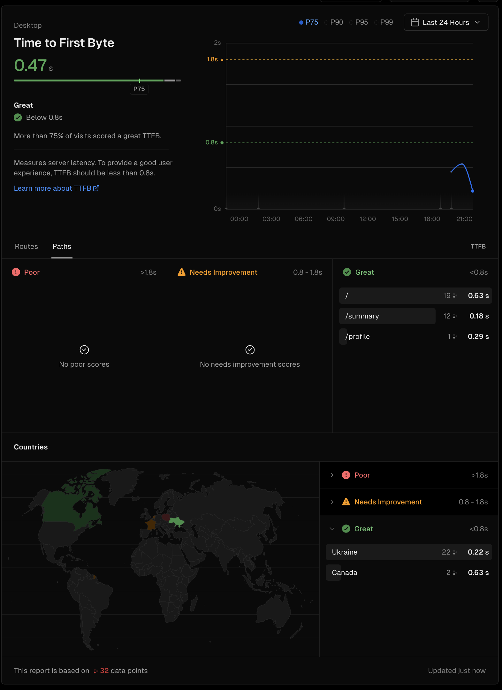
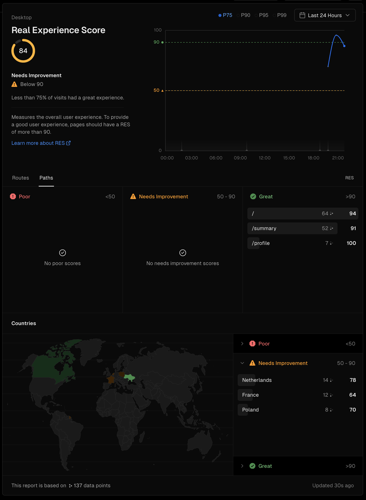

# TLDR portal Performance report

Application was deployed using Vercel, which provides built-in analytics and speed insights.

Note: this is available for Pro users, since our have a trial, we were able to leverage that functionality. Stats gathered asof 19.12.2023

References:

* [Vercel docs][1]
* [Metrics doc from Google developers][2]

## Overall stats

Statistic was gathered from ~2000 accesses from 5 different countries

## Calculated metrics

### First Contentful Paint

The First Contentful Paint (FCP) metric measures the time from when the user first navigated to the page to when any part of the page's content is rendered on the screen. For this metric, "content" refers to text, images (including background images), `<svg>` elements, or non-white `<canvas`> elements.

Analysis shown good performance of profile and summary pages, while entry page needs improvements.

### Largest Contentful Paint

The Largest Contentful Paint (LCP) metric reports the render time of the largest image or text block visible within the viewport, relative to when the user first navigated to the page.

Analysis shown good performance of profile and entry pages, while summary page has some large elements which are slowing down the rendering.

### Interaction to Next Paint

INP is a metric that assesses a page's overall responsiveness to user interactions by observing the latency of all click, tap, and keyboard interactions that occur throughout the lifespan of a user's visit to a page.

We can see that overall responsiveness on site is good.

### Cumulative Layout Shift

CLS is a measure of the largest burst of layout shift scores for every unexpected layout shift that occurs during the entire lifespan of a page.
A layout shift occurs any time a visible element changes its position from one rendered frame to the next. (See below for details on how individual layout shift scores are calculated.)

Since the application does not have any moving elements on the client-side we can low CLS value, which is good.

### First Input Delay

FID measures the time from when a user first interacts with a page (that is, when they click a link, tap on a button, or use a custom, JavaScript-powered control) to the time when the browser is actually able to begin processing event handlers in response to that interaction.

As we can see overall responsiveness is great.

### Time to First Byte

TTFB is a metric that measures the time between the request for a resource and when the first byte of a response begins to arrive.

Overall byte responsiveness is good but for some reason(probably internet connection) metrics for Poland users are not satisfactory.

### Real Experience Score

This is internal Vercel metrics which show overall user experience

[1]: https://vercel.com/docs "Vercel docs"
[2]: https://web.dev/explore/metrics "Mertics doc from Google developers"